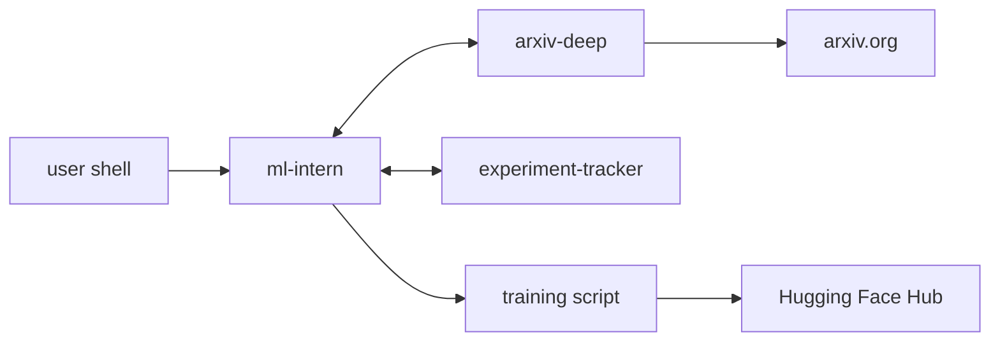

# ml-intern-mcp-toolkit

[](https://github.com/MrRobotop/ml-intern-mcp-toolkit/actions/workflows/ci.yml)
[](https://github.com/MrRobotop/ml-intern-mcp-toolkit/actions/workflows/lint.yml)
[](https://www.python.org/)
[](LICENSE)

Two MCP servers that extend [Hugging Face's `ml-intern`](https://github.com/huggingface/ml-intern)
with **deep arxiv reading** and **persistent experiment memory**.

## What this is

`ml-intern` is great at running ML jobs but treats the literature as
abstracts and treats every training run as a one-shot. This toolkit
fixes both:

- **`arxiv-deep`** lets the agent read the full text of a paper, surface
  its figures, find its linked code repositories, and produce a
  structured implementation brief that names the architecture, datasets,
  and hyperparameters worth reproducing.
- **`experiment-tracker`** gives the agent a SQLite-backed log of every
  run it has started, with metrics, artifacts, and a `compare_runs` /
  `best_run` API so the agent can pick the winning variant from a sweep.

Both servers speak MCP over stdio. They register against `ml-intern` via
its user-config layer; no fork required. The repo also ships an
end-to-end demo that drives `ml-intern` through the full loop (read paper
→ run three LoRA variants → log everything → publish the winner to
Hugging Face) on Apple Silicon or HF Jobs.

## Why it exists

If you have ever watched an ML agent confidently propose a hyperparameter
sweep based purely on a paper's abstract, only to forget which run won by
the third variant, you have felt the gap this toolkit closes. The agent
gets to *read* the paper and *remember* what it has tried.

## Architecture



Full diagrams and per-server detail are in [`docs/architecture.md`](docs/architecture.md).

## Quickstart

```bash
git clone https://github.com/MrRobotop/ml-intern-mcp-toolkit
cd ml-intern-mcp-toolkit
uv sync
uv run python examples/minimal_tracker_session.py     # see the tracker
uv run python examples/minimal_arxiv_query.py 2305.14314  # see arxiv-deep
```

To wire the servers into `ml-intern`, follow
[`docs/ml_intern_integration.md`](docs/ml_intern_integration.md).

## The two servers

### `arxiv-deep` (4 tools)

`fetch_paper`, `extract_figures`, `find_reference_code`,
`implementation_brief`. The agent calls `fetch_paper` first; the others
read from the same on-disk PDF cache. `implementation_brief` synthesises
the rest into a structured digest the agent can reason from. No LLM calls
inside any tool: the agent is the reasoner.

See [`docs/tool_reference.md`](docs/tool_reference.md#arxiv-deep) for the
full input/output schemas.

### `experiment-tracker` (7 tools)

`start_run`, `list_runs`, `complete_run`, `log_metric`, `log_artifact`,
`compare_runs`, `best_run`. SQLite + SQLModel; foreign-key enforcement
on every connection. `compare_runs` returns a Markdown table the agent
can paste into its reasoning. `best_run` returns `None` cleanly on empty
state so the agent does not have to wrap calls in `try`.

See [`docs/tool_reference.md`](docs/tool_reference.md#experiment-tracker)
for the full input/output schemas.

## Demo

`make demo` walks an `ml-intern` agent through the full loop end-to-end:
read the QLoRA paper, train three LoRA-rank variants of
`SmolLM2-135M-Instruct` on `tatsu-lab/alpaca`, log everything to the
tracker, pick the lowest-loss winner, push it to a Hugging Face
repository with a generated model card.

`DEMO_QUICK=1 make demo` runs the same loop on a 50/10 subset for fast
iteration. `DEMO_MODE=hf-jobs` runs the training in the cloud.

See [`demo/README.md`](demo/README.md) for env vars and prerequisites.

## Compatibility

- **Apple Silicon** (M-series Macs, macOS 15+). Confirmed on M5 Pro;
  earlier M-series should work but are untested. The training script
  uses MPS with `PYTORCH_ENABLE_MPS_FALLBACK=1` for unsupported ops.
- **Linux x86_64** (Ubuntu 22.04+). CI runs `ubuntu-latest` x
  `python-3.11/3.12`.
- **Windows** is not tested.

The MCP servers themselves are platform-independent Python; the
platform-sensitive piece is the demo's training script (torch + MPS).

## Contributing

See [`CONTRIBUTING.md`](CONTRIBUTING.md). The short version: open an
issue for non-trivial work, branch off `main`, run `make lint typecheck
test` before pushing, add a line to the `[Unreleased]` block of
[`CHANGELOG.md`](CHANGELOG.md), and run `make docs` if you touched a
tool description.

The repo also publishes a [`Code of Conduct`](CODE_OF_CONDUCT.md).

## License

[Apache 2.0](LICENSE).

## Citation

```bibtex
@software{ml_intern_mcp_toolkit_2026,
  author  = {Patil, Rishabh},
  title   = {ml-intern-mcp-toolkit: deep arxiv reading and experiment
             tracking for Hugging Face's ml-intern agent},
  year    = {2026},
  url     = {https://github.com/MrRobotop/ml-intern-mcp-toolkit},
  version = {0.1}
}
```
