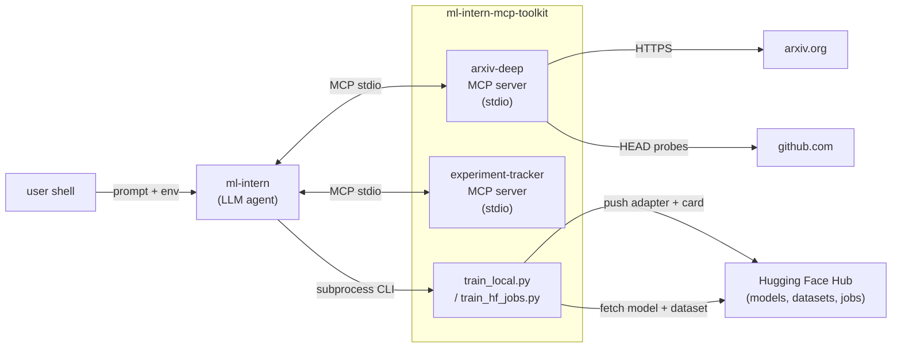
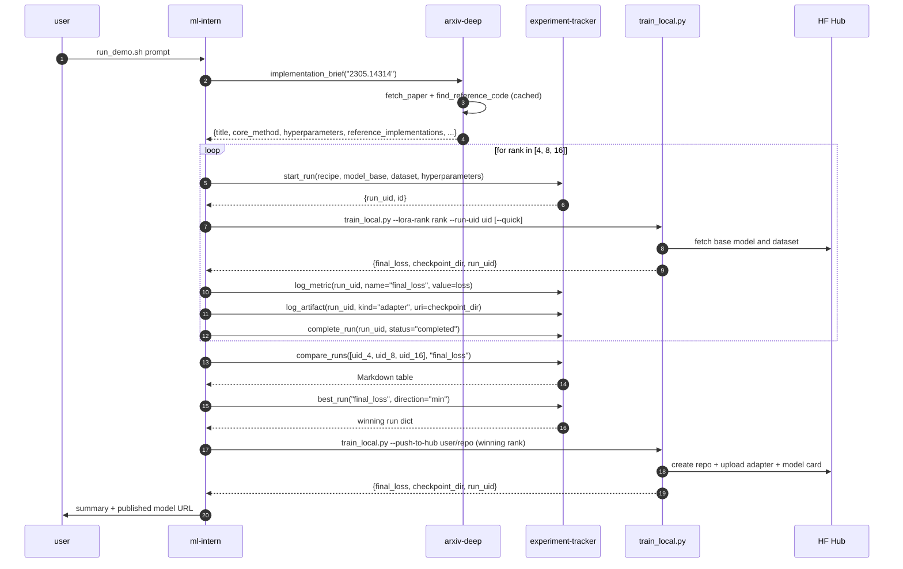

# Architecture

This document describes how the toolkit's pieces fit together: which
process owns which state, what crosses each wire, and where each cache
lives. Read this before changing any module's public surface.

For tool-by-tool detail see [`tool_reference.md`](tool_reference.md). For the
ml-intern-side wiring see [`ml_intern_integration.md`](ml_intern_integration.md).

---

## System diagram



The two MCP servers run as **subprocesses of `ml-intern`** spawned via
stdio. They live and die with the agent's session. The training scripts
are **invoked by the agent as a separate subprocess** when the agent
decides to run a variant; they do not speak MCP. Their integration
contract is the single-line JSON they print on stdout when training
completes.

---

## Demo run sequence



The agent owns the orchestration loop. The servers are passive: they
expose tools and respond to invocations. The training script is the only
component that actually loads weights or hits the GPU.

---

## Server: `arxiv-deep`

**Responsibilities.** Read arxiv papers properly. Fetch the full PDF text
(not just the abstract), extract figures with their captions, find
linked GitHub repositories with reachability checks, and synthesise a
heuristic implementation brief that surfaces the bits a developer needs
to start reproducing a paper.

**Process model.** Single FastMCP server speaking stdio. Tools are
registered in [`arxiv_deep/server.py`](../arxiv_deep/server.py). Each tool
is a pure Python function that returns a JSON-serialisable dict (or list of
dicts).

**Dependencies.** `arxiv` for metadata, `pymupdf` for PDF text and figure
extraction, `httpx` (async) for GitHub HEAD validation, `mcp` and FastMCP
for the protocol. No LLM calls inside any tool: the calling agent is the
reasoner.

**State.**

| What | Where | Lifetime |
|---|---|---|
| Cached PDFs | `$ARXIV_DEEP_CACHE_DIR/pdfs/<arxiv_id>.pdf` (default `~/.cache/arxiv-deep/pdfs/`) | persistent across sessions; idempotent |
| Cached figures | `$ARXIV_DEEP_CACHE_DIR/figures/<arxiv_id>/figure_<n>.png` | persistent |

**Test isolation.** Tests set `ARXIV_DEEP_CACHE_DIR` to a per-test tmp dir
and monkey-patch the network-touching helpers so the suite stays offline
deterministic. The `block_arxiv_api` fixture is a regression sentinel for
import-binding bugs that would otherwise leak network calls into a
nominally hermetic test.

---

## Server: `experiment-tracker`

**Responsibilities.** Persistent memory of training runs. Records each run's
recipe, base model, dataset, hyperparameters, and lifecycle status; logs
metrics over time; logs artifact URIs; lets the agent compare runs and pick
the best by metric value.

**Process model.** Single FastMCP server speaking stdio. Tools registered
in [`experiment_tracker/server.py`](../experiment_tracker/server.py). All
tools are synchronous; the database is local.

**Dependencies.** `sqlmodel` (SQLModel + SQLAlchemy 2.x), `mcp` and FastMCP
for the protocol. No external services.

**State.**

| Table | Owner | Notes |
|---|---|---|
| `run` | start_run / complete_run | Identity is `run_uid` (uuid4 hex); `id` is the FK target. JSON column for `hyperparameters`. |
| `metric` | log_metric | (run_id, step, name, value, logged_at). No uniqueness constraint on (step, name); the agent can log retries. |
| `artifact` | log_artifact | (run_id, kind, uri, created_at). Free-form `kind` string. |

The DB lives at `$EXPERIMENT_TRACKER_DB_PATH` (default
`~/.cache/experiment-tracker/runs.db`). Foreign-key enforcement is turned
on per connection via a SQLAlchemy event listener; without that step
SQLite would accept dangling `run_id` values silently.

**Engine acquisition.** Tool functions get an engine through
`experiment_tracker.db.current_engine()`, which `lru_cache`s by resolved DB
path. Tests redirect by setting the env var to a tmp file; production code
resolves to the user-cache default.

---

## Process boundary: ml-intern wiring

`ml-intern`'s config loader (`agent/config.py`) deep-merges a user config
over its base `configs/cli_agent_config.json`. Pointing
`$ML_INTERN_CLI_CONFIG` at `demo/ml_intern_config.json` adds the toolkit's
two servers to the agent's `mcpServers` dict. `ml-intern` then spawns each
as a subprocess via `fastmcp.Client` and routes tool calls to the right
server based on the `<server>_<tool>` namespace prefix.

No upstream fork is required. See
[`ml_intern_integration.md`](ml_intern_integration.md) for the full
config + env-var contract.

---

## Decisions log summary

The full log lives in [`CLAUDE.md`](../CLAUDE.md#decisions-log). The
load-bearing entries:

- **MCP framework choice:** `mcp.server.fastmcp.FastMCP` over the lowlevel
  `Server` class. Auto-derived schemas from type hints, `ToolError`
  exception wrapping, decorator + `add_tool` registration, stderr-only
  logging out of the box.
- **Stdio over HTTP:** the toolkit's servers are stdio-only by design.
  ml-intern launches them as subprocesses; HTTP would be redundant
  complexity for a single-user local agent.
- **Cache and DB paths overridable via env var.** `ARXIV_DEEP_CACHE_DIR`
  and `EXPERIMENT_TRACKER_DB_PATH` honour empty-string fallback to the
  default. Critical for both per-test isolation and sandboxed deployments.
- **Hermetic test pattern.** Tests monkey-patch `_download_pdf` /
  `_fetch_metadata` private hooks on the `arxiv_deep.tools.fetch` module
  so the suite never touches arxiv. The `block_arxiv_api` conftest fixture
  is a regression sentinel against the import-binding gotcha that bit us
  once.
- **SQLite FK enforcement on every connection.** A SQLAlchemy `connect`
  event listener issues `PRAGMA foreign_keys = ON`. Without this the
  "metric with unknown run_id raises IntegrityError" contract would fail
  silently and orphaned rows would accumulate.
- **JSON column for `hyperparameters`.** Explicit
  `sa_column=Column(JSON, nullable=False)` because SQLModel does not
  auto-infer JSON for `dict[str, Any]` and would fall back to a binary
  serialisation that we cannot query as JSON later.
- **`best_run` returns `None`** on empty DB / no-match filters / metric
  not present. Composes with conditional logic on the agent side.
- **Demo pivot from Qwen3-VL-2B to SmolLM2-135M-Instruct**, text-only,
  on Alpaca. transformers v5.x VLM processor regression made the original
  vision demo unstable; the narrative is unchanged and the iteration
  loop is 25× faster.
- **Demo publishes to user namespace by default.**
  `DEMO_PUSH_TO_ORG=1` opts in to `ml-agent-explorers/<repo>`. Refuse-on-
  exists prevents overwrite; iteration cannot leak junk to the org.
- **`ml-intern` user-config layer over upstream config edit.** Removes
  the maintenance trap of forking `ml-intern` per consumer.

---

## Where each piece lives in the repo

```
arxiv_deep/                          # arxiv-deep server
├── server.py                        # FastMCP wiring
├── exceptions.py                    # typed errors
└── tools/
    ├── fetch.py                     # fetch_paper + private hooks
    ├── figures.py                   # extract_figures (with caption regex + render fallback)
    ├── code.py                      # find_reference_code (async HTTPX)
    └── brief.py                     # implementation_brief (heuristic synthesis)

experiment_tracker/                  # tracker server
├── server.py
├── exceptions.py
├── models.py                        # SQLModel tables
├── db.py                            # engine, FK pragma, current_engine() cache
└── tools/
    ├── runs.py                      # start_run, list_runs, complete_run
    ├── metrics.py                   # log_metric
    ├── artifacts.py                 # log_artifact
    └── compare.py                   # compare_runs (Markdown), best_run

demo/                                # end-to-end agent demo
├── prompts/train_lora_alpaca.txt    # the prompt the agent receives
├── scripts/train_local.py           # MPS / CUDA / CPU LoRA fine-tune
├── scripts/train_hf_jobs.py         # run_uv_job wrapper
├── ml_intern_config.json            # user-config snippet for ml-intern
└── run_demo.sh                      # orchestrator

docs/
├── architecture.md                  # this file
├── ml_intern_integration.md
├── tool_reference.md                # generated from server registrations
└── troubleshooting.md

scripts/
├── setup.sh                         # local bootstrap
└── gen_tool_reference.py            # renders docs/tool_reference.md

tests/
├── conftest.py                      # shared fixtures (qlora_pdf, block_arxiv_api, ...)
├── arxiv_deep/                      # per-tool tests
├── experiment_tracker/              # per-tool tests
└── integration/                     # demo orchestration, demo config, tool-ref drift
```
